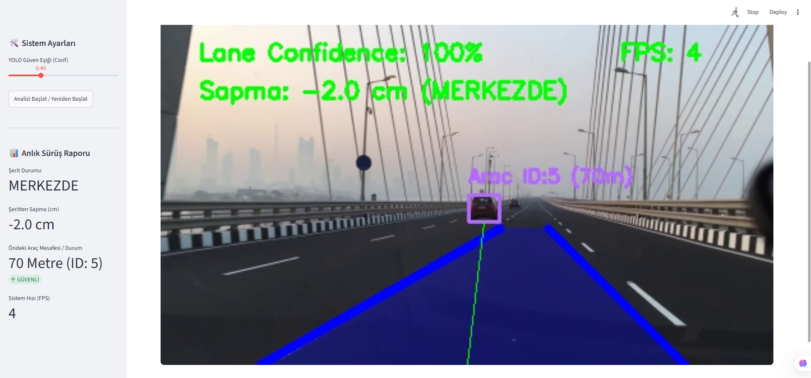

# 🚗 Otoyol Trafiğinde Şerit Sadakati ve Güvenli Takip Mesafesi Analiz Portalı



Bu proje, görüntü işleme (OpenCV) ve derin öğrenme (YOLOv8) tekniklerini bir arada kullanarak otoyol videoları üzerinden şeritten sapma oranlarını hesaplayan ve güvenli takip mesafesi analizi gerçekleştiren Streamlit tabanlı bir web portalıdır.

## 🌟 Özellikler
- **YOLOv8-Nano:** Trafikteki araçların (araba, kamyon, otobüs) gerçek zamanlı tespiti.
- **Hough Sürüş Hattı Analizi:** Canny Edge ve HoughLinesP kütüphaneleriyle şerit takibi ve araç merkez kalibrasyonu.
- **Dinamik Uyarı Sistemi:** Şeritten sapma miktarına göre (Merkezde, Hafif Kayma, Sola/Sağa Kayma) renk değiştiren koridor sistemi ve kritik takip mesafelerinde görsel **"YAKIN TAKİP"** uyarısı.
- **Streamlit Portalı:** Sürüş verilerini anlık grafiksel metriklerle sunan web arayüzü.

## 🚀 Kurulum ve Çalıştırma

1. Gerekli kütüphaneleri yükleyin:
   ```bash
   pip install streamlit ultralytics opencv-python numpy tqdm

## 📺 Proje Sonuç Videosu (Output Video)

Görüntü işleme ve YOLOv8 entegrasyonu tamamlanmış, şerit sadakati ve takip mesafesi analizini içeren 1107 frame'lik final çıktısını izlemek için aşağıdaki bağlantıyı ziyaret edebilirsiniz:

🔗 **[Google Drive - Proje Sonuç Videosunu İzle](https://drive.google.com/file/d/1fZ4kD2pnshnhxNnEuvPHgf9TM_WXEB21/view?usp=sharing)**
